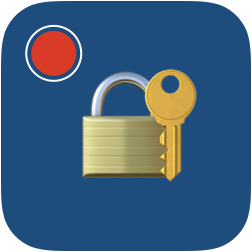
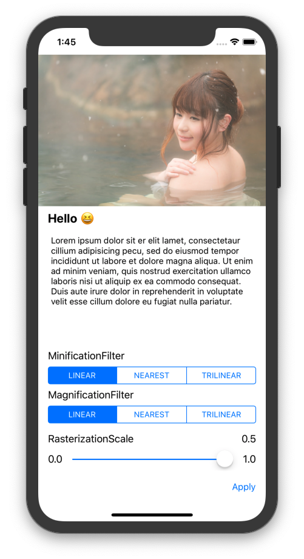
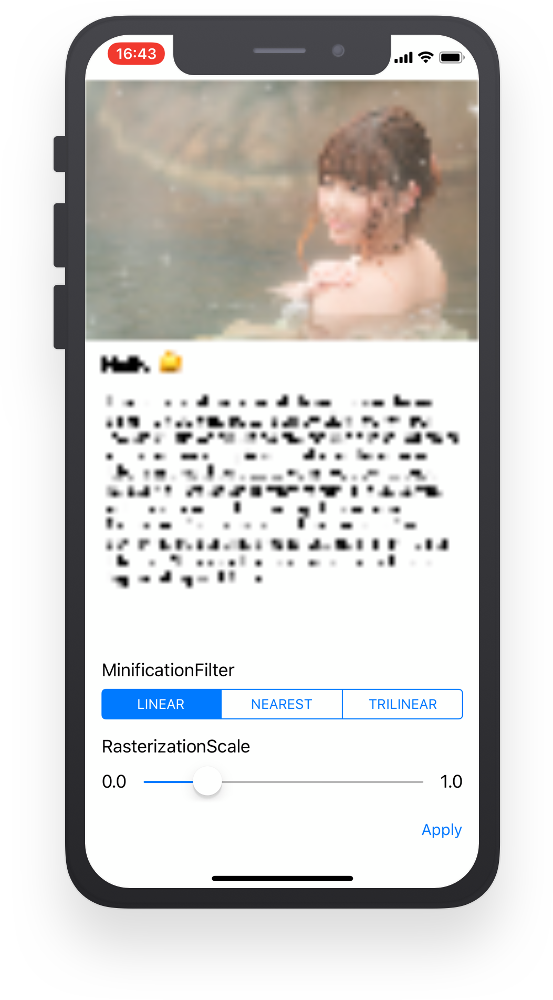

 RxScreenProtectKit
======================================

Protect private content from screen recordings and screen output.  
Screen Recording / QuickTime Recording / External display output / AirPlay

<div align="center">
 
</div>

# Installation
#### CocoaPods
```ruby
# Podfile
use_frameworks!

target 'YOUR_TARGET_NAME' do
    pod 'RxScreenProtectKit'
end
```
Replace YOUR_TARGET_NAME and then, in the Podfile directory, type:
```sh
$ pod install
```

#### Carthage
Add this to `Cartfile`.
```ruby
# Cartfile
github "AkkeyLab/RxScreenProtectKit"
```
Run this script to install it.
```sh
$ carthage update --platform iOS
```

# Usage
If you use the example, please do the setup process with the shell script.
```sh
./setup.sh
```
Please import RxScreenProtectKit and RxSwift.
```swift
import RxScreenProtectKit
import RxSwift
import UIKit
```
Implementing Mosaicable enables you to call isScreenRecord.
```swift
extension ViewController: Mosaicable {}
```
By binding the target layer to isScreenRecord, mosaic processing is applied during screen recording or screen output. However, the layer must be compliant with CALayer.
```swift
final class ViewController: UIViewController {
    @IBOutlet private weak var mainImageView: UIImageView!
    private let bag = DisposeBag()

    override func viewDidLoad() {
        super.viewDidLoad()
        isScreenRecord
            .bind(to: mainImageView.layer.rx.isMosaic)
            .disposed(by: bag)
    }
}
```
Parameter settings related to mosaic processing can be done from `ScreenProtectKit.config()`.
```swift
ScreenProtectKit.config(filter: .trilinear, scale: 0.1)
```

# Requirements
|env  |version |
|---    |---   |
|Swift  |5.0   |
|Xcode  |10.2  |
|iOS    |11.0  |

# License
RxScreenProtectKit is available under the MIT license. See the LICENSE file for more info.
